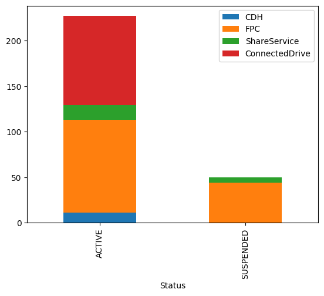

```python
import matplotlib.pyplot as plt
import pandas as pd

result = pd.read_csv("account_clean.csv")
result.info()        # 数据类型，内存消耗等信息


```

    <class 'pandas.core.frame.DataFrame'>
    RangeIndex: 302 entries, 0 to 301
    Data columns (total 8 columns):
     #   Column        Non-Null Count  Dtype 
    ---  ------        --------------  ----- 
     0   account_id    302 non-null    object
     1   Status        302 non-null    object
     2   fpc_status    302 non-null    object
     3   ou_name       302 non-null    object
     4   ou_id         302 non-null    object
     5   account_area  292 non-null    object
     6   account_type  226 non-null    object
     7   orbit         287 non-null    object
    dtypes: object(8)
    memory usage: 19.0+ KB


```python
result.describe()    # 统计特征，均值方差等
```


<div>
<style scoped>
    .dataframe tbody tr th:only-of-type {
        vertical-align: middle;
    }

    .dataframe tbody tr th {
        vertical-align: top;
    }

    .dataframe thead th {
        text-align: right;
    }
</style>
<table border="1" class="dataframe">
  <thead>
    <tr style="text-align: right;">
      <th></th>
      <th>account_id</th>
      <th>Status</th>
      <th>fpc_status</th>
      <th>ou_name</th>
      <th>ou_id</th>
      <th>account_area</th>
      <th>account_type</th>
      <th>orbit</th>
    </tr>
  </thead>
  <tbody>
    <tr>
      <th>count</th>
      <td>302</td>
      <td>302</td>
      <td>302</td>
      <td>302</td>
      <td>302</td>
      <td>292</td>
      <td>226</td>
      <td>287</td>
    </tr>
    <tr>
      <th>unique</th>
      <td>302</td>
      <td>2</td>
      <td>3</td>
      <td>10</td>
      <td>10</td>
      <td>4</td>
      <td>3</td>
      <td>2</td>
    </tr>
    <tr>
      <th>top</th>
      <td>'172688832633'</td>
      <td>ACTIVE</td>
      <td>enabled</td>
      <td>Halt</td>
      <td>ou-iv0p-a9u7znp3</td>
      <td>FPC</td>
      <td>default</td>
      <td>Non-Orbit</td>
    </tr>
    <tr>
      <th>freq</th>
      <td>1</td>
      <td>240</td>
      <td>257</td>
      <td>66</td>
      <td>66</td>
      <td>158</td>
      <td>116</td>
      <td>243</td>
    </tr>
  </tbody>
</table>
</div>


```python
result = result.query("orbit.notnull() or orbit == 'xxx'")
result
```


<div>
<style scoped>
    .dataframe tbody tr th:only-of-type {
        vertical-align: middle;
    }

    .dataframe tbody tr th {
        vertical-align: top;
    }

    .dataframe thead th {
        text-align: right;
    }
</style>
<table border="1" class="dataframe">
  <thead>
    <tr style="text-align: right;">
      <th></th>
      <th>account_id</th>
      <th>Status</th>
      <th>fpc_status</th>
      <th>ou_name</th>
      <th>ou_id</th>
      <th>account_area</th>
      <th>account_type</th>
      <th>orbit</th>
    </tr>
  </thead>
  <tbody>
    <tr>
      <th>0</th>
      <td>'172688832633'</td>
      <td>ACTIVE</td>
      <td>enabled</td>
      <td>CDH(Advanced)</td>
      <td>ou-iv0p-ac92i7kp</td>
      <td>CDH</td>
      <td>advanced</td>
      <td>Non-Orbit</td>
    </tr>
    <tr>
      <th>1</th>
      <td>'173679732911'</td>
      <td>ACTIVE</td>
      <td>enabled</td>
      <td>CDH(Advanced)</td>
      <td>ou-iv0p-ac92i7kp</td>
      <td>CDH</td>
      <td>advanced</td>
      <td>Non-Orbit</td>
    </tr>
    <tr>
      <th>2</th>
      <td>'179158169094'</td>
      <td>ACTIVE</td>
      <td>enabled</td>
      <td>CDH(Advanced)</td>
      <td>ou-iv0p-ac92i7kp</td>
      <td>CDH</td>
      <td>advanced</td>
      <td>Non-Orbit</td>
    </tr>
    <tr>
      <th>3</th>
      <td>'320707650407'</td>
      <td>ACTIVE</td>
      <td>enabled</td>
      <td>CDH(Advanced)</td>
      <td>ou-iv0p-ac92i7kp</td>
      <td>CDH</td>
      <td>advanced</td>
      <td>Non-Orbit</td>
    </tr>
    <tr>
      <th>4</th>
      <td>'321176096694'</td>
      <td>ACTIVE</td>
      <td>enabled</td>
      <td>CDH(Advanced)</td>
      <td>ou-iv0p-ac92i7kp</td>
      <td>CDH</td>
      <td>advanced</td>
      <td>Non-Orbit</td>
    </tr>
    <tr>
      <th>...</th>
      <td>...</td>
      <td>...</td>
      <td>...</td>
      <td>...</td>
      <td>...</td>
      <td>...</td>
      <td>...</td>
      <td>...</td>
    </tr>
    <tr>
      <th>296</th>
      <td>'424206487579'</td>
      <td>ACTIVE</td>
      <td>enabled</td>
      <td>Operations</td>
      <td>ou-iv0p-8htcpgwz</td>
      <td>ShareService</td>
      <td>default</td>
      <td>Non-Orbit</td>
    </tr>
    <tr>
      <th>297</th>
      <td>'424285566716'</td>
      <td>ACTIVE</td>
      <td>enabled</td>
      <td>Operations</td>
      <td>ou-iv0p-8htcpgwz</td>
      <td>ShareService</td>
      <td>default</td>
      <td>Non-Orbit</td>
    </tr>
    <tr>
      <th>299</th>
      <td>'183749528048'</td>
      <td>ACTIVE</td>
      <td>enabled</td>
      <td>Architecting</td>
      <td>ou-iv0p-9w0seqm8</td>
      <td>ShareService</td>
      <td>davanced</td>
      <td>Non-Orbit</td>
    </tr>
    <tr>
      <th>300</th>
      <td>'421807133856'</td>
      <td>ACTIVE</td>
      <td>enabled</td>
      <td>Architecting</td>
      <td>ou-iv0p-9w0seqm8</td>
      <td>ShareService</td>
      <td>davanced</td>
      <td>Non-Orbit</td>
    </tr>
    <tr>
      <th>301</th>
      <td>'430714857437'</td>
      <td>ACTIVE</td>
      <td>enabled</td>
      <td>Architecting</td>
      <td>ou-iv0p-9w0seqm8</td>
      <td>ShareService</td>
      <td>davanced</td>
      <td>Non-Orbit</td>
    </tr>
  </tbody>
</table>
<p>287 rows × 8 columns</p>
</div>


```python

group_result = result.groupby(['Status','account_area']).count().reset_index()
group_result
```


<div>
<style scoped>
    .dataframe tbody tr th:only-of-type {
        vertical-align: middle;
    }

    .dataframe tbody tr th {
        vertical-align: top;
    }

    .dataframe thead th {
        text-align: right;
    }
</style>
<table border="1" class="dataframe">
  <thead>
    <tr style="text-align: right;">
      <th></th>
      <th>Status</th>
      <th>account_area</th>
      <th>account_id</th>
      <th>fpc_status</th>
      <th>ou_name</th>
      <th>ou_id</th>
      <th>account_type</th>
      <th>orbit</th>
    </tr>
  </thead>
  <tbody>
    <tr>
      <th>0</th>
      <td>ACTIVE</td>
      <td>CDH</td>
      <td>11</td>
      <td>11</td>
      <td>11</td>
      <td>11</td>
      <td>11</td>
      <td>11</td>
    </tr>
    <tr>
      <th>1</th>
      <td>ACTIVE</td>
      <td>ConnectedDrive</td>
      <td>98</td>
      <td>98</td>
      <td>98</td>
      <td>98</td>
      <td>98</td>
      <td>98</td>
    </tr>
    <tr>
      <th>2</th>
      <td>ACTIVE</td>
      <td>FPC</td>
      <td>102</td>
      <td>102</td>
      <td>102</td>
      <td>102</td>
      <td>98</td>
      <td>102</td>
    </tr>
    <tr>
      <th>3</th>
      <td>ACTIVE</td>
      <td>ShareService</td>
      <td>16</td>
      <td>16</td>
      <td>16</td>
      <td>16</td>
      <td>16</td>
      <td>16</td>
    </tr>
    <tr>
      <th>4</th>
      <td>SUSPENDED</td>
      <td>FPC</td>
      <td>44</td>
      <td>44</td>
      <td>44</td>
      <td>44</td>
      <td>0</td>
      <td>44</td>
    </tr>
    <tr>
      <th>5</th>
      <td>SUSPENDED</td>
      <td>ShareService</td>
      <td>6</td>
      <td>6</td>
      <td>6</td>
      <td>6</td>
      <td>0</td>
      <td>6</td>
    </tr>
  </tbody>
</table>
</div>


```python
# head()方法，不指定行数，则默认显示5行，单列的类型是Series

# [['account_id','x']] 过滤多个字段
# group_result = result.groupby(by=['Status','account_area'])[['account_id']].agg([("count_total","count")]).reset_index()

# ['account_id'] 过滤一个字段
group_result = result.groupby(by=['Status','account_area'])['account_id'].agg([("count_total","count")]).reset_index()
group_result
```


<div>
<style scoped>
    .dataframe tbody tr th:only-of-type {
        vertical-align: middle;
    }

    .dataframe tbody tr th {
        vertical-align: top;
    }

    .dataframe thead th {
        text-align: right;
    }
</style>
<table border="1" class="dataframe">
  <thead>
    <tr style="text-align: right;">
      <th></th>
      <th>Status</th>
      <th>account_area</th>
      <th>count_total</th>
    </tr>
  </thead>
  <tbody>
    <tr>
      <th>0</th>
      <td>ACTIVE</td>
      <td>CDH</td>
      <td>11</td>
    </tr>
    <tr>
      <th>1</th>
      <td>ACTIVE</td>
      <td>ConnectedDrive</td>
      <td>98</td>
    </tr>
    <tr>
      <th>2</th>
      <td>ACTIVE</td>
      <td>FPC</td>
      <td>102</td>
    </tr>
    <tr>
      <th>3</th>
      <td>ACTIVE</td>
      <td>ShareService</td>
      <td>16</td>
    </tr>
    <tr>
      <th>4</th>
      <td>SUSPENDED</td>
      <td>FPC</td>
      <td>44</td>
    </tr>
    <tr>
      <th>5</th>
      <td>SUSPENDED</td>
      <td>ShareService</td>
      <td>6</td>
    </tr>
  </tbody>
</table>
</div>


```python

# 行转列 : https://www.cnblogs.com/ElonJiang/p/16486111.html
# 将"Status"和"account_area"设置为索引, 然后取出"count_total"这一列, 得到对应的具有二级索引的 Series 对象
two_level_index_series = group_result.set_index(["Status", "account_area"])["count_total"]
print("two_level_index_series: ")
print(two_level_index_series)

# 调用具有二级索引的Series的unstack, 会得到一个DataFrame
# 并会自动把一级索引变成DataFrame的索引, 二级索引变成DataFrame的列
new_df = two_level_index_series.unstack()

# 可以通过 rename_axis(index=, columns=) 来给坐标轴重命名
new_df = new_df.rename_axis(columns=None)
print("new_df: ")
print(new_df)

# 这里我们只给列重命名, 没有给索引重命名, 至于原因请往下看
new_df = new_df.reset_index()

new_df.plot.bar(stacked=True,x='Status',y=['CDH','FPC','ShareService','ConnectedDrive'])
plt.show()

```

    two_level_index_series: 
    Status     account_area  
    ACTIVE     CDH                11
               ConnectedDrive     98
               FPC               102
               ShareService       16
    SUSPENDED  FPC                44
               ShareService        6
    Name: count_total, dtype: int64
    new_df: 
                CDH  ConnectedDrive    FPC  ShareService
    Status                                              
    ACTIVE     11.0            98.0  102.0          16.0
    SUSPENDED   NaN             NaN   44.0           6.0


    

    

